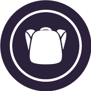
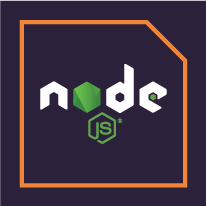

## 📈 Current preview

 

## 🤝 Contact with me

 

[
](https://www.linkedin.com/in/md-salim-reza-sumon-99027220a/) [ 
](https://www.facebook.com/salimreza.sumon.5/) 

 

## 🧑‍💻 What I know

 

 

## 🔎 Current overview

 Looking for an intern or a full time job. Working on my own project and gaining skill day by day. Looking for some opportunity to grow up.

<!---
isalim079/isalim079 is a ✨ special ✨ repository because its `README.md` (this file) appears on your GitHub profile.
You can click the Preview link to take a look at your changes.
--->
